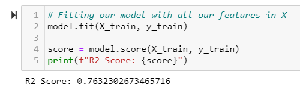
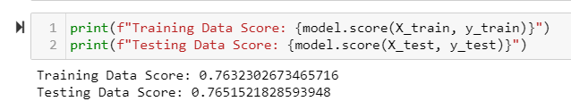
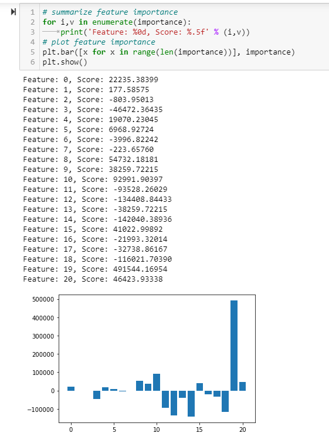

#  Living in Nashville

## Overview
The fastest growing city in Tennessee is the Nashville-Davidson–Murfreesboro–Franklin metro area. Its population grew by 19.1% from 2010 to 2020 to 1,961,232 residents. During that same time, the population of Tennessee grew by 8.5%, and the U.S. population increased by 6.7%. 

With the COVID-19 pandemic a bit under control, the U.S. economy has made an incredible comeback. Consumer spending is strong, jobs are coming back, and the housing market is booming, and quite possibly the hottest it’s been in years.

Here locally in Middle Tennessee, there’s a new spotlight on our economic growth. Through several economic downturns, a massive flood, and tornadoes, Nashville has always shown resilience. Now is no different.

## Purpose
Our team lives in and around the Nashville area so as our final project, we chose to predict the sales price of housing in the Nashville Metro area based on key factors that may have influence on the price of the houses. 

Final determination was made to use Supervised Learning with the Regression model to minimize the error of prediction.  Through the ETL process, we will determine our features. The target will be the Sales Price.  

The key steps are listed below: 

1. Framing the Problem  
2. Getting the Data  
3. Exploring the Data  
4. Data Preprocessing  
5. Model Development  
6. Model Tuning/Ensemble Learning  
7. Deploying Model  
8. Presentation of Solution  

## Resources:
Kaggle dataset:  https://www.kaggle.com/tmthyjames/nashville-housing-data/activity 
Enrollment - June 2021 from Metro Nashville Public Schools:  https://mnps.org/about/communications/opendata 
Parks:  https://data.nashville.gov/Parks/Park-Locations/74d7-b74t 
Restaurants/Social:  http://nashvilleguru.com/nashville-restaurants-and-bars 

## Software(s): 

SQLite, Python 3.7, Pandas, Numpy, Matplotlib, Scikit-Learn

## Presentation: 

Google Slides:  https://docs.google.com/presentation/d/1GFjG-l6xeNtwq9jgkAt1YndmvLPib42iHLwfS4r0gK8/edit?usp=sharing

Tableau Public:  https://public.tableau.com/app/profile/joy.richardson/viz/FinalProject_16366012495220/AvgSalesPricebyZip?publish=yes

### Week 1

* Created a branch for each section in the Rubric:  Presentation, Machine_Learning_Model, Database and Dashboard_Tableau

* Found several datasets as noted above. Each dataset needed manual editing in preparation to include zip codes as our common feature

* Determination was made to use pgAdmin for our server and AWS for our database

### Week 2

* Reviewed each dataset to determine the columns to drop and began Extract, transform, load (ETL) process on the data

* Created pg Admin server and AWS database and all team members connected

* Began creation of Machine Learning Model

* Began learning/working with Google slides

### Week 3

* ETL ipynb file is complete and uploaded to the Database_Nashville branch

* Google slide presentation in progress - shared link above

* Determined that using AWS to host our database was not necessary as we will use Tableau for our visualization

* Related to above, we also decided to use SQLite instead of pgAdmin for our database

* Machine Learning Model has been created as an outline and uploaded to the Machine_Learning_Model branch

### Week 4

* Discussed the best way to connect the database to the Machine Learning Model

* Cleaned up the Database_Nashville branch and mergde to Main

* Merge the Machine_Learning_Model branch to Main

* Connection of the model to the dataframe

* Tableau will connect directly to the csv files for visualizations

* Began building visualizations in Tableau - shared link above

* Completed Machine Learning Model

* Continued work on presentation and Tableau

## Results:

Using the Housing and Parks dataframes, we merged the dataframes and trained and tested our dataset and fit the model.  R-squared or R2 explains the degree to which your input variables explain the variation of your output / predicted variable. So, if R-square is 0.86, it means 86% of the variation in the output variable is explained by the input variables.   

 

Below shows the consistency of results in the training and testing datasets. As expected, the testing data is (slightly) smaller than the training data. 

 

We summarized the feature importance and found that the following features were the most significant in our dataset.  Feature 12 = if there are ADA parks and Feature 14 = if there is a walking/jogging path (in a zip code)

 

